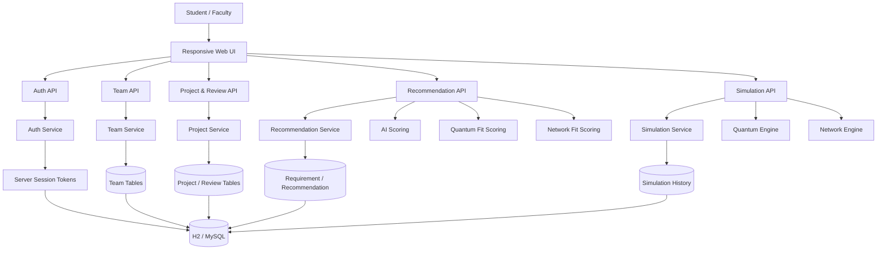

# AI Nexus — Final Architecture



## Security boundary

```text
Browser
  ↓ Bearer session token
AuthInterceptor
  ↓ authenticated User
Controller
  ↓
Service authorization
  ↓
Repository
```

Passwords are BCrypt-hashed. Privileged roles are never accepted from public registration.
