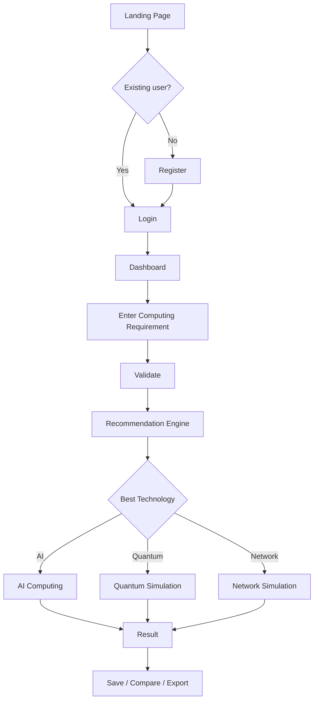
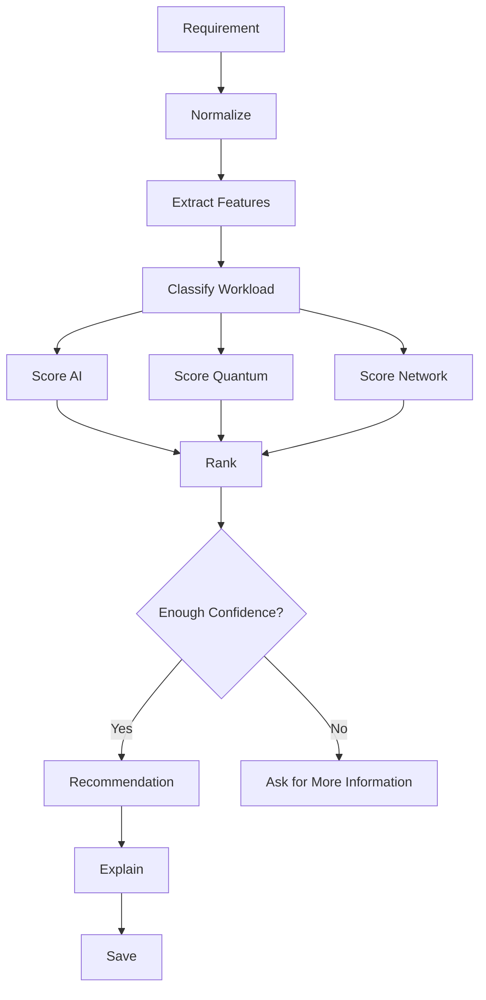
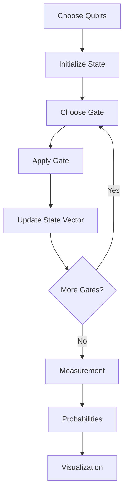
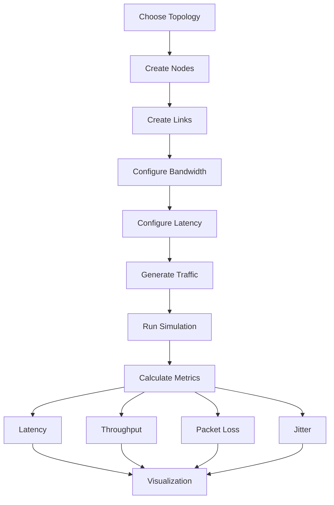

# AI Nexus — Flowcharts

## 1. Complete user flow

```mermaid
flowchart TD
    A[Landing Page] --> B{Existing user?}
    B -->|Yes| C[Login]
    B -->|No| D[Register]
    D --> C
    C --> E[Dashboard]
    E --> F[Enter Computing Requirement]
    F --> G[Validate]
    G --> H[Recommendation Engine]
    H --> I{Best Technology}
    I -->|AI| J[AI Computing]
    I -->|Quantum| K[Quantum Simulation]
    I -->|Network| L[Network Simulation]
    J --> M[Result]
    K --> M
    L --> M
    M --> N[Save / Compare / Export]
```

## 2. Recommendation flow

```mermaid
flowchart TD
    A[Requirement] --> B[Normalize]
    B --> C[Extract Features]
    C --> D[Classify Workload]
    D --> E[Score AI]
    D --> F[Score Quantum]
    D --> G[Score Network]
    E --> H[Rank]
    F --> H
    G --> H
    H --> I{Enough Confidence?}
    I -->|Yes| J[Recommendation]
    I -->|No| K[Ask for More Information]
    J --> L[Explain]
    L --> M[Save]
```

## 3. Quantum simulation

```mermaid
flowchart TD
    A[Choose Qubits] --> B[Initialize State]
    B --> C[Choose Gate]
    C --> D[Apply Gate]
    D --> E[Update State Vector]
    E --> F{More Gates?}
    F -->|Yes| C
    F -->|No| G[Measurement]
    G --> H[Probabilities]
    H --> I[Visualization]
```

## 4. Network simulation

```mermaid
flowchart TD
    A[Choose Topology] --> B[Create Nodes]
    B --> C[Create Links]
    C --> D[Configure Bandwidth]
    D --> E[Configure Latency]
    E --> F[Generate Traffic]
    F --> G[Run Simulation]
    G --> H[Calculate Metrics]
    H --> I[Latency]
    H --> J[Throughput]
    H --> K[Packet Loss]
    H --> L[Jitter]
    I --> M[Visualization]
    J --> M
    K --> M
    L --> M
```
